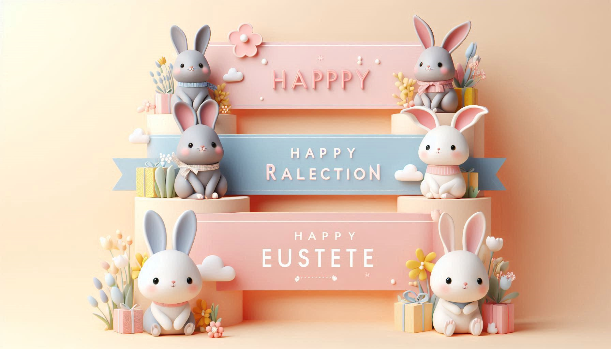

  

<h3 align="center">Rabbit City </h3>

---

 This repository contains the code for a rabbit city game. Players can collect different rabbits, each with unique attributes.
      

## 📝 Table of Contents

-   [About](#about)
-   [Contributing](#cb)
-   [Authors](#authors)
-   [Acknowledgments](#acknowledgement)

## 🧐 About 

-   Rabbit Collection: Players can collect various rabbits.
-   Rabbit Attributes: Each rabbit has unique attributes!
-   Game Progression: As players collect more rabbits, they can unlock new features or levels.

## 🚀 Contributing 

Contributions are welcome! Please follow these guidelines:

Fork the repository.
Create a new branch.
Make your changes.  
Submit a pull request.

## License 

This project is licensed under the Apache License (Apache-2.0). See the LICENSE file for details.
